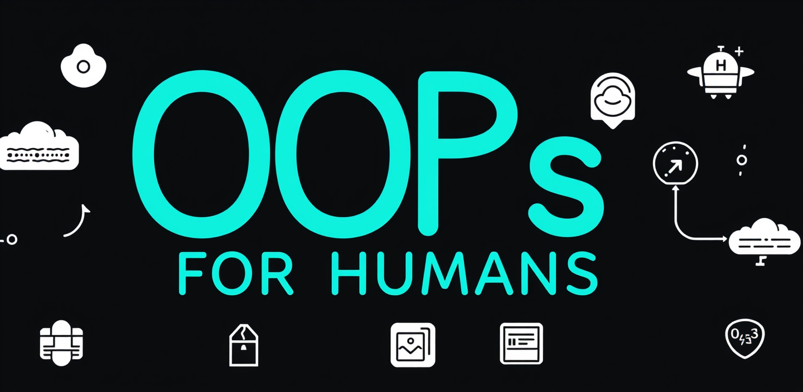

 

  

***

🎉 "Object-Oriented Programming for Humans"! 🎉

Ever read about OOP, felt like you understood it, and then completely blanked out when trying to explain it? Yeah, same. And just when you think you've got it all, an interview question or a random topic throws in something you’ve never even heard of—making you wonder if you ever really learned OOP at all.     This is my attempt to fix that both for myself and anyone else who needs it—just clear explanations, real-world examples, and an effort to make sure no part gets left behind. 

 

***

<!-- # Index - Object-Oriented Programming (OOP)    -->

## **Core Concepts**  
1. **What is Object-Oriented Programming (OOP)?**  
   - Classes, Objects, Attributes, Methods  
   - Real-World Analogies (LEGO, Library)  

2. **Classes and Objects**  
   - Class Declaration, Object Instantiation  
   - Instance vs. Class Variables/Methods  

3. **Encapsulation**  
   - Access Modifiers (Public, Private, Protected)  
   - Getters/Setters, Data Hiding  

4. **Inheritance**  
   - Superclass vs. Subclass  
   - Types of Inheritance (Single, Multiple, Multilevel, Hierarchical, Hybrid)  
   - Method Overriding, `super()` Keyword  

5. **Polymorphism**  
   - Compile-Time (Method Overloading) vs. Runtime (Method Overriding)  
   - Dynamic Method Dispatch  

6. **Abstraction**  
   - Abstract Classes, Interfaces  
   - Pure Virtual Functions  

7. **Class Relationships**  
   - Association, Aggregation, Composition, Dependency  

---

## **Advanced OOP Topics**  
8. **Constructors and Destructors**  
   - Default, Parameterized, Copy Constructors  
   - Destructors in Java/Python/C++  

9. **Object Lifetime & Memory Management**  
   - Garbage Collection vs. Manual Memory Management  

10. **Static and Final Keywords**  
    - Static Variables/Methods, Final Classes/Methods/Variables  

11. **Interfaces vs. Abstract Classes**  
    - Default Methods in Interfaces, Abstract Methods  

12. **Generics/Templates**  
    - Type Parameterization, Bounded Types  

13. **Exception Handling**  
    - Custom Exceptions, Try-Catch Blocks  

14. **Operator Overloading**  

15. **Reflection**  
    - Introspection of Classes/Methods at Runtime  

16. **Object Serialization/Deserialization**  
    - JSON, Binary Formats, Security Considerations  

17. **Concurrency in OOP**  
    - Thread-Safe Objects, Synchronization  

18. **Type Casting**  
    - Upcasting/Downcasting, `instanceof`/`typeid` Checks  

19. **Messaging Between Objects**  

20. **Namespace/Package Organization**  

21. **Object Cloning**  
    - Shallow vs. Deep Copy  

22. **Immutable Objects**  

23. **Event-Driven Programming**  

24. **Dependency Injection**  

25. **Unit Testing in OOP**  
    - Mock Objects, Testing Frameworks  

26. **Root Object Class**  
    - `Object` (Java), `NSObject` (Swift), `object` (Python)  

---

## **Object-Oriented Design & Modeling**  
27. **UML Diagrams**  
    - Class Diagrams, Sequence Diagrams, Use Case Diagrams  

---

## **Design Principles**  
28. **SOLID Principles**  
    - Single Responsibility  
    - Open/Closed  
    - Liskov Substitution  
    - Interface Segregation  
    - Dependency Inversion  

29. **Coupling and Cohesion**  
    - Low Coupling, High Cohesion  

30. **Composition Over Inheritance Principle**  

---

## **Language-Specific Features**  
31. **Friend Classes/Functions (C++)**  

32. **Inner/Nested Classes**  

33. **Mixins and Traits**  
    - Python, Ruby, Scala  

34. **Multiple Inheritance Handling**  
    - Interfaces (Java), Virtual Inheritance (C++), MRO (Python)  

---

## **Miscellaneous**  
- **Real-World Analogies** for All Concepts  
- **Code Examples** in Python, Java, C++, JavaScript  
- **Best Practices** and Common Pitfalls  
- **Visual Aids** (Diagrams, Flowcharts)  

---

## **Getting Started**  
- How to Use This Repository  
- Recommended Learning Path  